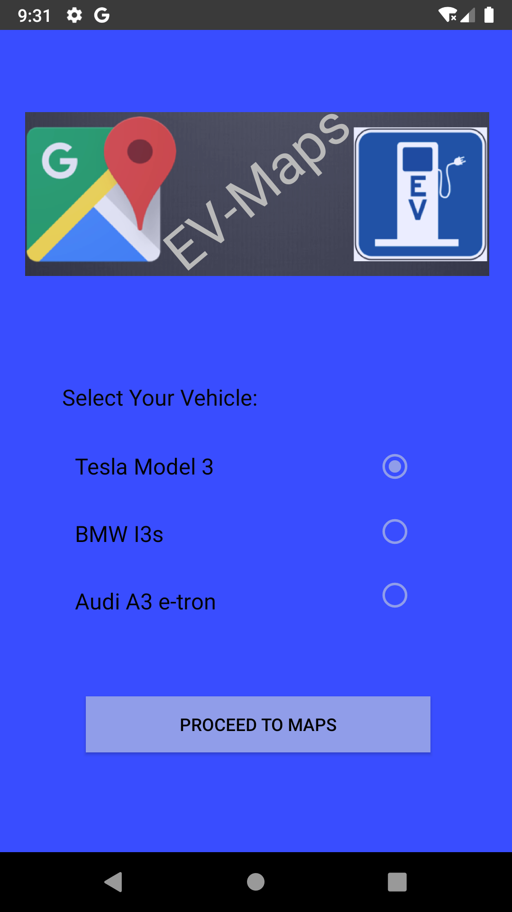
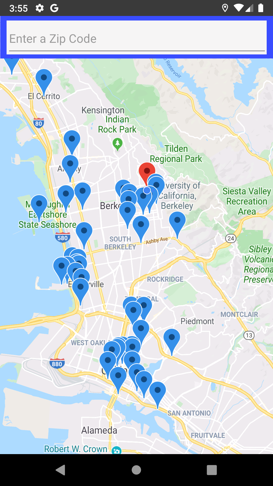
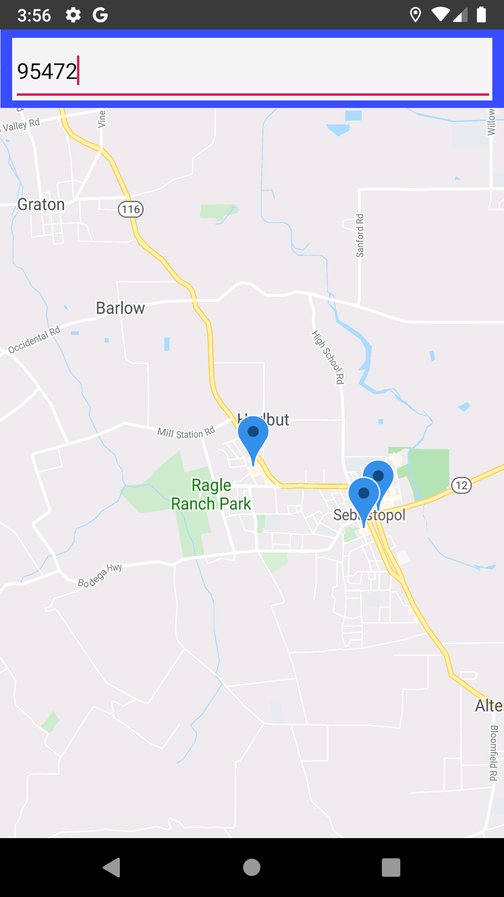
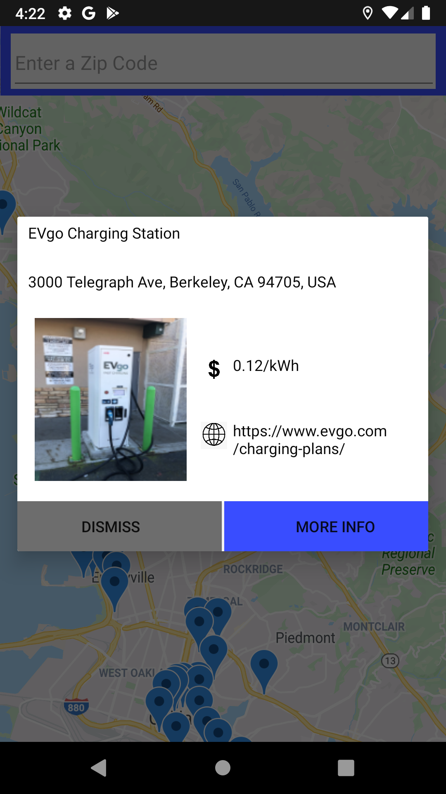
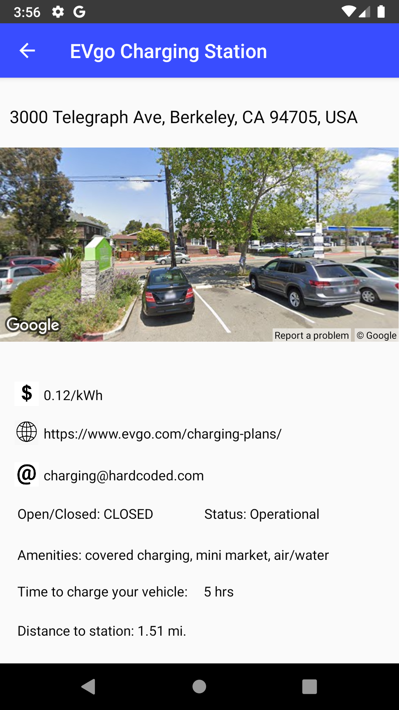

# prog02b-fa19-connorgriffith
prog02b-fa19-connorgriffith created by GitHub Classroom

EV-Maps - 
Produced by Connor Griffith (SID# 3033293226)

[Description]

This is an app that allows electric vehicle owners to find nearby charging stations with ease.  
By using the powerful APIs provided by Google, this app will allow Tesla Model 3, BMW I3s, and Audi A3 e-tron owners to find out specific details about any charging station within a 50,000 meter radius of their current location.  
If any users are going on a trip and curious of the EV support in the area, they can use the zip code search functionality to get all charging stations within a 50,000 meter radius of their search.

